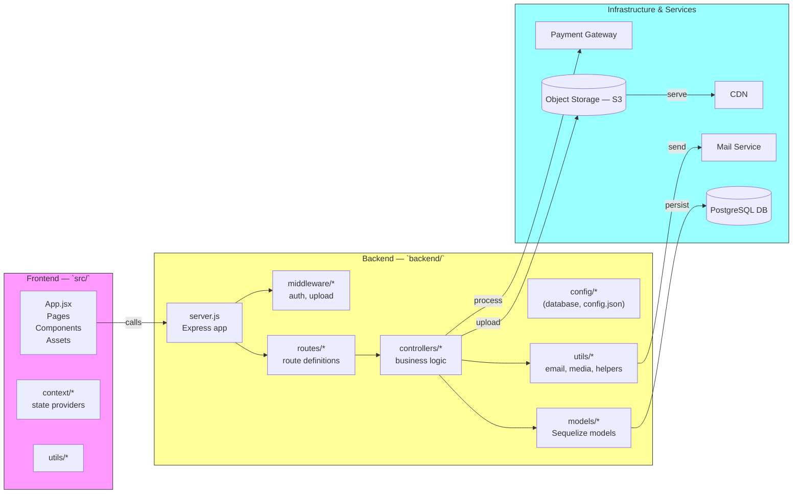

# Package Diagram

Below is a package-level diagram for the Artistry project (Mermaid format).

Notes:
- Frontend package maps to `src/` and contains UI, pages, and client-side state.
- Backend package maps to `backend/` and contains API surface, controllers, models, and middleware.
- Infrastructure packages show external services the packages interact with.
